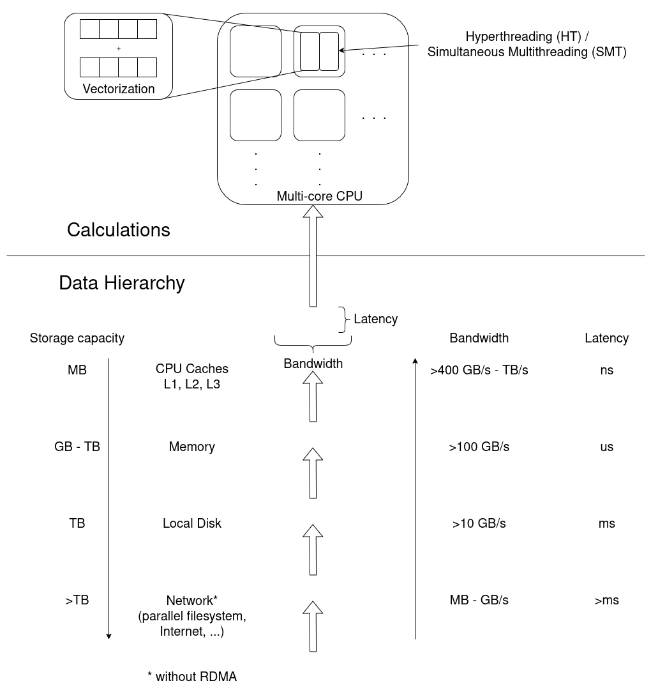

:::::::::::::::::::::::::::::::::::::: questions 

- Why are tools like `seff` and `sacct` not enough?
- What steps can I take to assess a jobs performance?
- What popular types of reports exist? (e.g. Roofline)

::::::::::::::::::::::::::::::::::::::::::::::::

::::::::::::::::::::::::::::::::::::: objectives

After completing this episode, participants should be able to …

- Explain different approaches to performance measurements.
- Understand common terms and concepts in performance analyses.
- Create a performance report through a third-party tool.
- Describe what a performance report is meant for (establish baseline, documentation of issues and improvements through optimization, publication of results, finding the next thread to pull in a quest for optimization)
- Measure the performance of central components of underlying hardware (CPU, Memory, I/O, ...) (split episode?)
- Identify which general areas of computer hardware may affect performance.

::::::::::::::::::::::::::::::::::::::::::::::::


:::::::::::::::::::::::::: instructor
## Intention: Introduce third party tools for performance reports

Narrative:

- Scaling study, scheduler tools, project proposal is written and handed in
- Maybe I can squeeze out more from my current system by trying to understand better how it behaves
- Another colleague told us about performance measurement tools
- We are learning more about our application
- Aha, there IS room to optimize! Compile with vectorization


What we're doing here:

- Get a complete picture
- Introduce missing metrics / definitions
- Relate to hardware on the same level of detail

:::::::::::::::::::::::::::::::::::::


## Workflow
- Define sampling and tracing
- Describe common approaches

## Tools
Performance counters and permissions, may require `--exclusive`, depends on system! Look at documentation / talk to your administrators / support.
```
cap_perfmon,cap_sys_ptrace,cap_syslog=ep
kernel.perf_event_paranoid
```

## General report
- General reports show direction in which to continue
   - Specialized tools may be necessary


## How Does Performance Relate to Hardware?
:::::::::::::::::::::::::: instructor
## ToDo: Connect Hardware to Performance Measurements

Introduce hardware on the same level of detail and with the same terms as the performance reports by ClusterCockpit, LinaroForge, etc., as soon as they appear.
Only introduce what we need, to avoid info dump.
But point to additional information that gives a complete overview -> hpc-wiki!

:::::::::::::::::::::::::::::::::::::

(Following this structure throughout the course, trying to understand the performance in these terms)

Broad dimensions of performance:

- CPU (Front- and Backend, FLOPS)
   - Frontend: decoding instructions, branch prediction, pipeline
   - Backend: getting data from memory, cache hierarchy & alignment
   - Raw calculations
   - Vectorization
   - Out-of-order execution
- Accelerators (e.g. GPUs)
   - More calculations
   - Offloading
   - Memory & communication models
- Memory (data hierarchy)
   - Working memory, reading data from/to disk
   - Bandwidth of data
- I/O (broader data hierarchy: disk, network)
   - Stored data
   - Local disk (caching)
   - Parallel fs (cluster-wide)
   - MPI-Communiction
- Parallel timeline (synchronization, etc.)
   - Application logic


::::: instructor
## ToDo: Clarify relation to hardware in this course
Maybe we should either focus on components (CPUs, memory, disk, accelerators, network cards) or functional entities (compute, data hierarchy, bandwidth, latency, parallel timelines)

We shouldn't go into too much detail here.
Define broad categories where performance can be good or bad. (calculations, data transfers, application logic, research objective (is the calculation meaningful?))

Reuse categories in the same order and fashion throughout the course, i.e. point out in what area a discovered inefficiency occurs.

Introduce detail about hardware later where it is needed, e.g. NUMA for pinning and hints.
::::::::::::::::



:::::::::::::::::::::::::: challenge
## Exercise: Match application behavior to hardware

Which part of the computer hardware may become an issue for the following application patterns:

1. Calculating matrix multiplications
2. Reading data from processes on other computers
3. Calling many different functions from many equally likely if/else branches
4. Writing very large files (TB)
5. Comparing many different strings if they match
6. Constructing a large simulation model
7. Reading thousands of small files for each iteration

Maybe not the best questions, also missing something for accelerators.

:::: solution
1. CPU (FLOPS) and/or Parallel timeline
2. I/O (network)
3. CPU (Front-End)
4. I/O (disk)
5. (?) CPU-Backend, getting strings through the cache?
6. Memory (size)
7. I/O (disk)
:::::::::::::
::::::::::::::::::::::::::::::::::::


## Summary

:::::::::::::::::::::::::: challenge
## Exercise:
::::::::::::::::::::::::::::::::::::

Leading question: Connection to hardware is quite deep, why does it matter? -> Drill deeper, e.g. on NUMA & pinning

:::::::::::::::::::::::::::::::::::::: keypoints
- First things first, second things second, ...
- Profiling, tracing
- Sampling, summation
- Different HPC centers may provide different approaches to this workflow
- Performance reports offer more insight into the job and application behavior
::::::::::::::::::::::::::::::::::::::::::::::::
